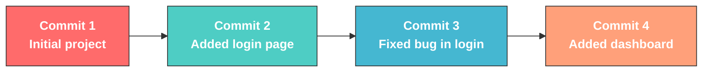
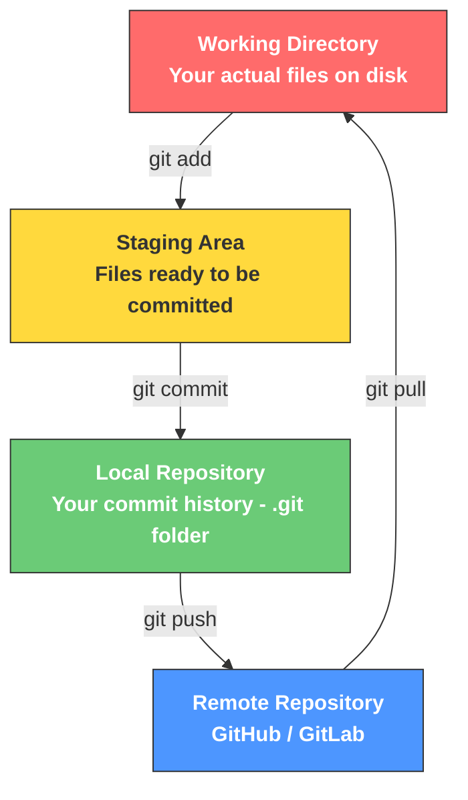
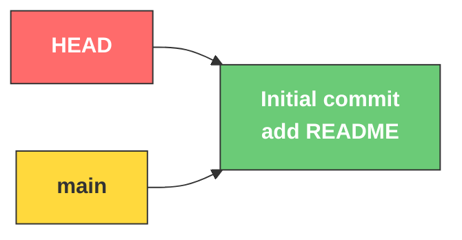
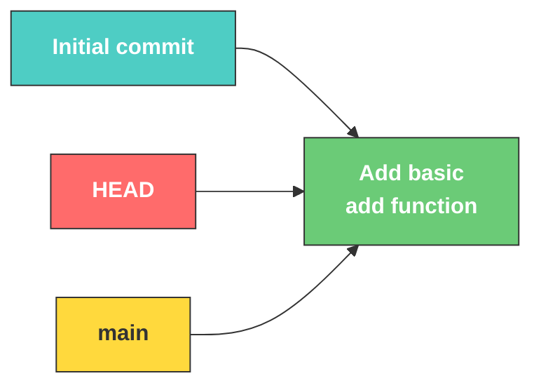
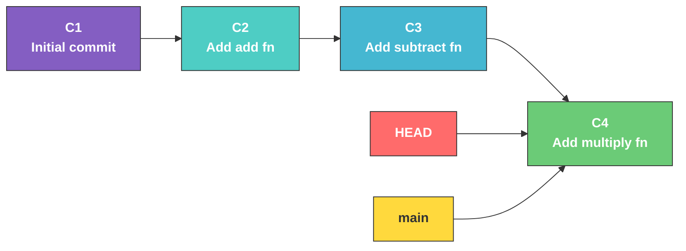
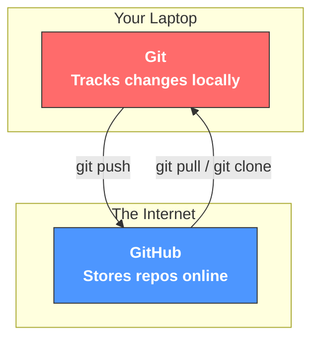
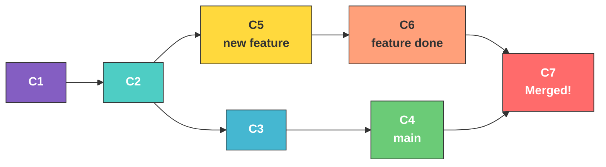
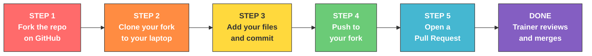
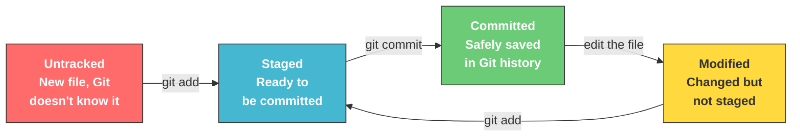
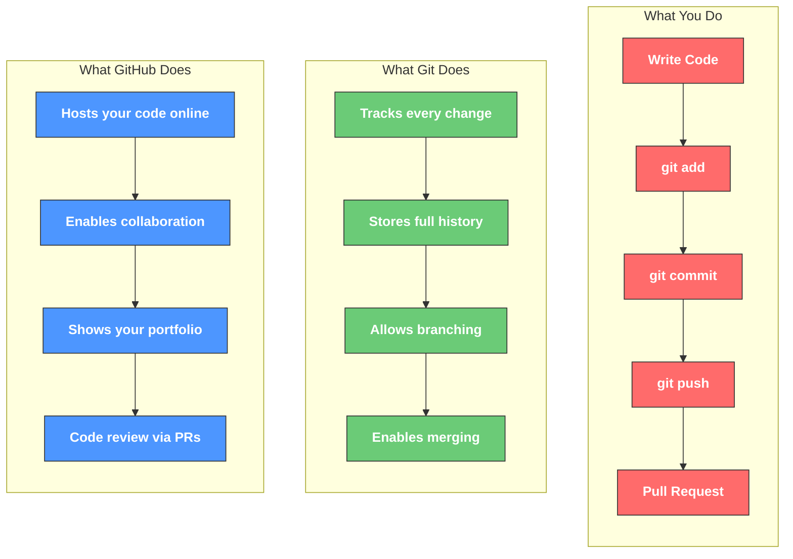

# Git & GitHub — The Complete Beginner's Guide

> **For AI-Adventure Students at IIIT Basar**
> Short. Sweet. No fluff. Just what you need to know.

---

## What is Git?

Git is a **version control system** — it tracks every change you make to your files.

Think of it like this:

> You're writing an exam answer. You write version 1, then erase some parts and write version 2. With a normal file, version 1 is **gone forever**. With Git, **every version is saved**. You can go back to any point in time.

**Git is a database.** It stores the complete history of your project — who changed what, when, and why.

---

## Git is a DAG (Directed Acyclic Graph)

This sounds scary. It's not. Let's break it down.

**DAG = Directed Acyclic Graph**
- **Directed** — changes flow in one direction (parent → child)
- **Acyclic** — you can NEVER go back to a previous commit (no loops!)
- **Graph** — commits are connected like a tree/network



> **Key rule:** Children NEVER point back to parents. Time only moves forward. That's what makes it **acyclic**.

Each commit is a **snapshot** of your entire project at that moment. Git doesn't store differences — it stores the **full picture** every time (efficiently, using compression).

---

## How Git Stores Your Project



| Zone | Where? | What happens here? |
|------|--------|--------------------|
| **Working Directory** | Your laptop | You edit files here |
| **Staging Area** | Still your laptop | You pick which changes to save |
| **Local Repository** | `.git` folder | Git saves your commits here |
| **Remote Repository** | GitHub.com | Your code lives online for everyone |

---

## Real Example: Building a Calculator Project

Let's track a small project step by step and see how the Git graph grows.

### Step 1: Create the project

```bash
mkdir calculator && cd calculator
git init
echo "# Calculator App" > README.md
git add README.md
git commit -m "Initial commit: add README"
```

**Git graph after Step 1:**



> **HEAD** = "Where am I right now?" It points to your current position in the graph.
> **main** = The default branch name.

### Step 2: Add the calculator code

```bash
echo "def add(a, b): return a + b" > calc.py
git add calc.py
git commit -m "Add basic add function"
```

**Git graph after Step 2:**



### Step 3: Add more operations

```bash
echo "def subtract(a, b): return a - b" >> calc.py
git add calc.py
git commit -m "Add subtract function"
```

```bash
echo "def multiply(a, b): return a * b" >> calc.py
git add calc.py
git commit -m "Add multiply function"
```

**Git graph after Step 3:**



> See how it grows? Each commit points to the next. You can **always** go back to C1 or C2 if something breaks.

### Step 4: Push to GitHub

```bash
git remote add origin https://github.com/yourname/calculator.git
git push -u origin main
```

Now your entire graph (C1 → C2 → C3 → C4) is on GitHub too!

---

## What is GitHub?

| Git | GitHub |
|-----|--------|
| A tool on your **computer** | A **website** that hosts Git repos |
| Works **offline** | Needs **internet** |
| Tracks changes **locally** | Stores your code **online** |
| You use it from the **terminal** | You use it from a **browser** |
| Created by Linus Torvalds (2005) | Created by Tom Preston-Werner (2008) |

**Simple analogy:**

> **Git** = Microsoft Word's "Track Changes" feature
> **GitHub** = Google Drive where you store and share your Word docs



### What can you do on GitHub?

- **Store** your code online (backup + portfolio)
- **Collaborate** with others (Pull Requests)
- **Share** your work with the world (public repos)
- **Track issues** and bugs
- **Host websites** (GitHub Pages)
- **Show off** to recruiters (your GitHub IS your resume)

---

## Branching — Working Without Breaking Things

A **branch** is a separate line of work. You create a branch, make changes, and merge it back when it's ready.



> **Why branch?** So your half-finished work doesn't break the main project. When it's ready, you merge it in.

---

## The Fork & Pull Request Workflow

This is exactly what you do for AI-Adventure assignments:



| Step | What Happens |
|------|-------------|
| **Fork** | You create YOUR copy of the repo on GitHub |
| **Clone** | You download YOUR copy to your laptop |
| **Work** | You make changes locally (add assignments) |
| **Push** | You upload changes to YOUR fork |
| **Pull Request** | You ask the trainer to merge your work into the original |

---

## Top 15 Git Commands You'll Use Daily

### Setup Commands (One-time)

```bash
# Install check
git --version

# Tell Git who you are
git config --global user.name "Your Name"
git config --global user.email "your@email.com"
```

### Starting a Project

```bash
# Clone an existing repo
git clone https://github.com/username/repo.git

# OR create a new repo from scratch
git init
```

### The Daily Workflow (You'll use these the most!)

```bash
# Check what's changed
git status

# Stage files (prepare for commit)
git add filename.py          # add one file
git add .                    # add everything

# Save a snapshot
git commit -m "your message here"

# Upload to GitHub
git push origin main

# Download latest changes
git pull origin main
```

### Viewing History

```bash
# See all commits
git log

# See a shorter version
git log --oneline

# See what changed in each file
git diff
```

### Branching (You'll learn this soon)

```bash
# Create and switch to a new branch
git checkout -b feature-name

# Switch back to main
git checkout main

# Merge a branch into main
git merge feature-name
```

---

## The Commit Lifecycle — Visual Summary



---

## Golden Rules for Beginners

| # | Rule | Why? |
|---|------|------|
| 1 | **Commit often** | Small commits are easier to understand and undo |
| 2 | **Write clear messages** | "Fix login bug" > "asdfgh" |
| 3 | **Pull before you push** | Avoids conflicts with others' changes |
| 4 | **Don't panic** | Git saves everything. You can almost always undo |
| 5 | **Use `git status` constantly** | It tells you exactly what's going on |

---

## Common Mistakes & How to Fix Them

### "I committed but forgot to add a file!"

```bash
git add forgotten_file.py
git commit --amend -m "Updated commit message"
```

### "I want to undo my last commit but keep the changes!"

```bash
git reset --soft HEAD~1
```

### "I accidentally edited the wrong file!"

```bash
git checkout -- filename.py
```

### "I want to see what I changed before committing!"

```bash
git diff
```

---

## Quick Recap — The Big Picture



---

> **Remember:** Every expert was once a beginner who refused to give up. You've got this.
